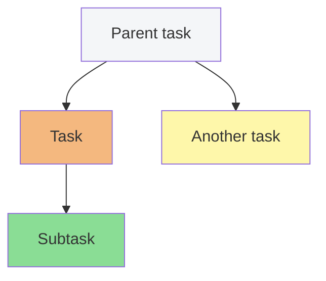

```mermaid
graph TD
    mastermind["Parent task"]
    play-1-round["Task"]
    play-10-rounds["Another task"]
    player-makes-guess["Subtask"]

    mastermind --> play-1-round
    play-1-round --> player-makes-guess
    mastermind --> play-10-rounds

    classDef parent-task fill:#f4f6f8
    classDef todo fill:#fef7aa
    classDef in-progress fill:#f4b87f
    classDef completed fill:#8add95
    classDef blocked fill:#f1a2a0
    classDef punt fill:#b5abf4
    classDef notes fill:#b8cffa

		class play-10-rounds todo
    class play-1-round in-progress
    class player-makes-guess completed
    class mastermind parent-task
```
