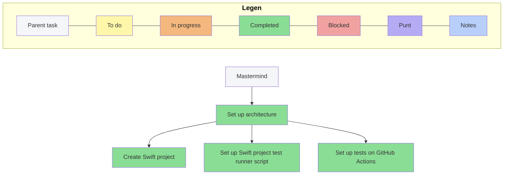

Use skill "discovery-tree"

```mermaid
graph TD
    subgraph legend["Legend"]
        direction LR
        legend-parent-task["Parent task"] --- legend-todo["To do"] --- legend-in-progress["In progress"] --- legend-completed["Completed"] --- legend-blocked["Blocked"] --- legend-punt["Punt"] --- legend-notes["Notes"]
    end

    mastermind["Mastermind"]
    setup-architecture["Set up architecture"]
    create-swift-project["Create Swift project"]
    setup-test-runner-script["Set up Swift project test runner script"]
    setup-tests-github-actions["Set up tests on GitHub Actions"]

    legend ~~~ mastermind

    mastermind --> setup-architecture
    setup-architecture --> create-swift-project
    setup-architecture --> setup-test-runner-script
    setup-architecture --> setup-tests-github-actions

    classDef parent-task fill:#f4f6f8
    classDef todo fill:#fef7aa
    classDef in-progress fill:#f4b87f
    classDef completed fill:#8add95
    classDef blocked fill:#f1a2a0
    classDef punt fill:#b5abf4
    classDef notes fill:#b8cffa

    class legend-parent-task parent-task
    class legend-todo todo
    class legend-in-progress in-progress
    class legend-completed completed
    class legend-blocked blocked
    class legend-punt punt
    class legend-notes notes

    style legend color:#000000,font-size:18px,font-weight:bold

    class mastermind parent-task
    class setup-architecture completed
    class create-swift-project completed
    class setup-test-runner-script completed
    class setup-tests-github-actions completed

```

