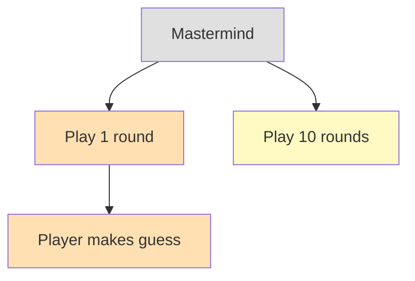

```mermaid
graph TD
    mastermind["Mastermind"]
    play-1-round["Play 1 round"]
    play-10-rounds["Play 10 rounds"]
    player-makes-guess["Player makes guess"]

    mastermind --> play-1-round
    play-1-round --> player-makes-guess
    mastermind --> play-10-rounds

    classDef todo fill:#fff9c4
    classDef in-progress fill:#ffe0b2
    classDef done fill:#c8e6c9
    classDef blocked fill:#ffcdd2
    classDef punt fill:#e1bee7
    classDef notes fill:#bbdefb
    class play-10-rounds todo
    class play-1-round,player-makes-guess in-progress

    classDef parent-task fill:#e0e0e0
    class mastermind parent-task
```
