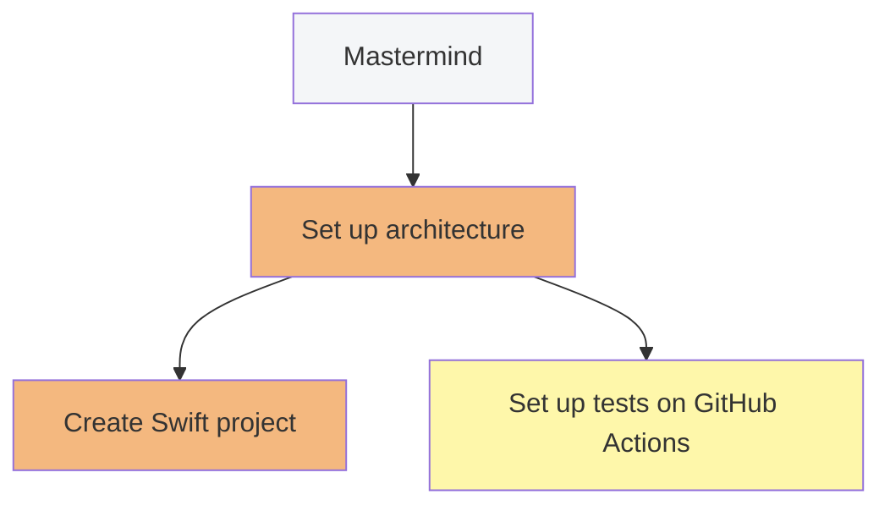

```mermaid
graph TD
    mastermind["Mastermind"]
    setup-architecture["Set up architecture"]
    create-swift-project["Create Swift project"]
    setup-tests-github-actions["Set up tests on GitHub Actions"]

    mastermind --> setup-architecture
    setup-architecture --> create-swift-project
    setup-architecture --> setup-tests-github-actions

    classDef parent-task fill:#f4f6f8
    classDef todo fill:#fef7aa
    classDef in-progress fill:#f4b87f
    classDef completed fill:#8add95
    classDef blocked fill:#f1a2a0
    classDef punt fill:#b5abf4
    classDef notes fill:#b8cffa

    class mastermind parent-task
    class setup-architecture in-progress
    class create-swift-project in-progress
    class setup-tests-github-actions todo

```
