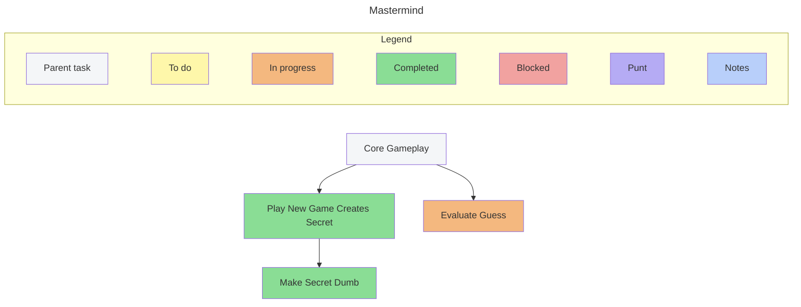

```mermaid
---
title: Mastermind
---
graph TD
    subgraph legend["Legend"]
        direction LR
        legend-parent-task["Parent task"] ~~~ legend-todo["To do"] ~~~ legend-in-progress["In progress"] ~~~ legend-completed["Completed"] ~~~ legend-blocked["Blocked"] ~~~ legend-punt["Punt"] ~~~ legend-notes["Notes"]
    end

    core-gameplay["Core Gameplay"]
    play-game["Play New Game Creates Secret"]
    enter-guess["Evaluate Guess"]

    legend ~~~ core-gameplay

    inject-secret-maker["Make Secret Dumb"]

    core-gameplay --> play-game
    core-gameplay --> enter-guess
    play-game --> inject-secret-maker

    classDef parent-task fill:#f4f6f8
    classDef todo fill:#fef7aa
    classDef in-progress fill:#f4b87f
    classDef completed fill:#8add95
    classDef blocked fill:#f1a2a0
    classDef punt fill:#b5abf4
    classDef notes fill:#b8cffa

    class legend-parent-task parent-task
    class legend-todo todo
    class legend-in-progress in-progress
    class legend-completed completed
    class legend-blocked blocked
    class legend-punt punt
    class legend-notes notes

    class core-gameplay parent-task
    class play-game completed
    class enter-guess in-progress
    class inject-secret-maker completed

```
